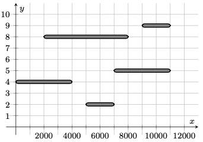

# Conveyor Chaos

## Problem Description

A distribution center moves packages around using a system of conveyor belts, which can be represented as line segments on the 2D Cartesian plane. The $i\text{th}$ conveyor belt runs from coordinates $(A_i,H_i)$ to $(B_i,H_i)$. No two conveyor belts share any points in common, including endpoints or interior points. Gravity points in the direction of the negative y-axis, meaning that objects normally fall vertically downwards, with their y-coordinate decreasing over time.

Each conveyor belt runs to either the left or the right. A package can be considered to occupy a single point on the plane. If a package lands strictly within conveyor belt $i$ (excluding its endpoints), then it will be transported to its left or right end (either $(A_i,H_i)$ or $(B_i,H_i)$), depending on the conveyor belt's direction, before continuing to fall vertically downwards.

You'll start by selecting a single conveyor belt and choosing a fixed direction (either left or right) for it to run in. Then, random directions will be independently chosen for each of the remaining $N-1$ conveyor belts (each being either left or right with equal probability). Finally, a single package will be dropped into the system from high above, at coordinates $(x,1{\small,}000{\small,}000)$, where $x$ is a real value drawn uniform randomly from the inclusive interval $[0, 1{\small,}000{\small,}000]$. Your objective is to minimize the expected horizontal distance which this package will travel along conveyor belts before hitting the ground (any point with y-coordinate $0$).

For example, consider the following system of conveyor belts (as are present in the second sample case):

Consider picking the conveyor belt at y-coordinate $5$ and causing it to run to the left. If it then so happens that the bottommost conveyor belt also runs to the left while the other three run to the right and the package falls at x-coordinate $3{\small,}000$, then the package will travel a total of $6{\small,}000$ units horizontally across conveyor belts, as illustrated below:

Determine the minimum achievable expected horizontal distance traveled by the package assuming an ideal initial choice of conveyor belt and direction.

## Constraints

$1 \leq N \leq 500{\small,}000$

$1 \leq H_i \leq 999{\small,}999$

$0 \leq A_i < B_i \leq 1{\small,}000{\small,}000$

## Approach

A high-level overview of my approach is as follows:
1. Create a list of conveyor objects, sorted in non-increasing order of height
2. Track which conveyor (if any) is the left/right child of a given conveyor, where the left/right child is the conveyor that a package dropped from the left/right of a given conveyor would land on next.
3. Track the expected horizontal movement that a package dropped on any given conveyor should experience after reaching the conveyor, assuming direction to be random.
4. Track the likelihood that a package will land on a given conveyor, assuming all other conveyors have a random direction, as well as the expected horizontal travel distance of a package that lands on the conveyor given that the conveyor is known to move either left or right.
5. Determine the expected horizontal travel distance of a package assuming all conveyors run at a random direction.
6. For each conveyor and direction, determine the reduction in expected movement that setting the conveyor to run in a specific direction will result in. Store the greatest of these reductions and subtract this from the formerly determined expected travel distance.